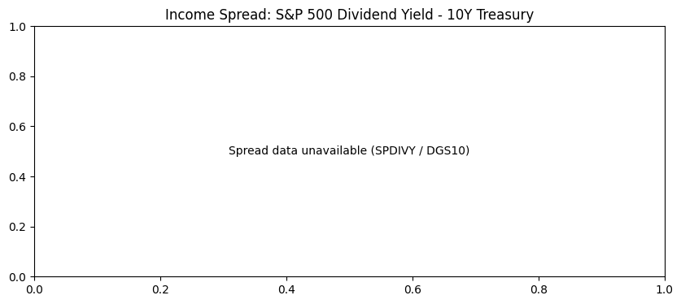

# Market Risk Monitor

**🟢 Recovery**  
**Score:** Downturn 0/3 | Recovery 3/3  
**Last Updated:** 2026-05-03

---

⚠️ **Disclaimer**

This is an automated market signal summary for informational purposes only. It is not financial advice.

---

## AI Risk Commentary

Risk commentary:
Market is in a recovery phase but vulnerabilities remain: volatility is moderate, energy-related volatility (OVX) is elevated, and interest rates are still relatively high. Equity breadth looks constructive vs major moving averages, supporting upside, yet higher yields and commodity volatility could compress multiples or trigger rotation if growth data weakens. Monitor rate moves and OVX for signs the recovery is losing momentum.

Market summary:
- Regime: Recovery (stable)
- SPY: 720.65, trading above 200-day MA (670.94) — bullish trend
- QQQ: 674.15, above its 100-day MA (615.0) — tech trend supportive
- VIX: 16.99 — moderate/benign equity volatility
- OVX: 75.4, regime mid — oil volatility elevated, watch energy risks
- TNX / 10Y yield: 4.4% — yields elevated vs recent years; potential headwind for multiples
- Income spread (S&P dividend yield vs 10Y): raw data missing (SP dividend yield null) — spread cannot be computed; 10Y = 4.4%
- ARKK: three-month change +3.44% — modest positive momentum in high-beta/innovation names
- Mortgage rate: 6.3% — condition: Neutral
- Other: Overall conditions stable for risk-on, but keep an eye on rising yields and OVX for regime shifts

Raw data available in /data.

---

## Charts

### SPY Trend

### QQQ Trend

### ARKK Drawdown

### VIX

### 10Y Yield

### Oil Volatility

### Mortgage Conditions

### Equity vs Bond Income Spread

---

## Market Snapshot

- SPY: 720.65 (200MA: 670.94)
- QQQ: 674.15 (100MA: 615.0)
- ARKK 3M Change: 3.44%

- VIX: 16.99
- TNX (10Y Yield): 4.4%
- OVX (Oil Volatility): 75.4

- Mortgage Rate: 6.3%
- Mortgage Condition: Neutral

- S&P 500 Dividend Yield: Data unavailable
- 10Y Yield (for spread): 4.4%
- Income Spread (Div - 10Y): Data unavailable
- Income Regime: Unknown

[View raw data](data/market_snapshot.json)

---

## Latest Audio Update

[Listen to today's update](https://raw.githubusercontent.com/kam-reef/market-summary/main/audio/latest.mp3)

---

## RSS Feed

https://kam-reef.github.io/market-summary/feed.xml

---

## Data

- Signals: [data/signals.json](data/signals.json)  
- History: [data/history.json](data/history.json)
