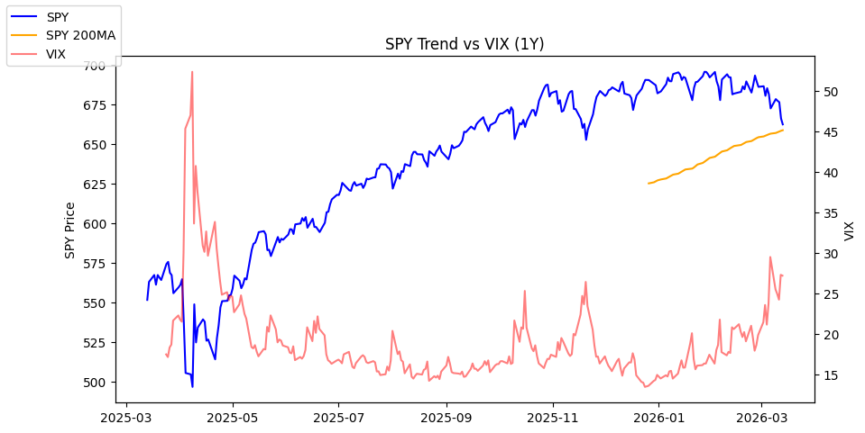
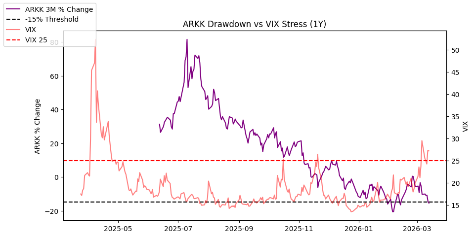

# Market Risk Monitor

⚠️ **Disclaimer**

This project is an experimental data pipeline and educational demonstration.
It is **not financial advice**. The signals and AI commentary are generated
automatically from public market data and may be incomplete, delayed, or
incorrect. Do not make investment decisions based upon any data, display, words or summary in this repository.

Last Updated: 2026-03-17

## Market Regime
🟡 Mixed Signals

## AI Risk Commentary

Risk commentary:
Market shows mixed signals—large-cap broad market (SPY) remains marginally above its 200-day average, which is a constructive sign, but momentum wanes in growth/tech (QQQ below its 100-day MA) and volatility is elevated (VIX > 25). Elevated VIX points to meaningful investor uncertainty and a higher probability of near-term intraday or multi-day swings. Position sizing and stop discipline are advisable; consider reducing exposure to high-volatility or highly beta-sensitive names and keep some dry powder or hedges in place until clearer trend confirmation.

Market summary (bullets):
- Regime label: 🟡 Mixed Signals.
- SPY: price 662.29 vs 200-day MA 658.6 — slightly above the 200MA (bullish bias but marginal).
- QQQ: price 593.72 vs 100-day MA 614.82 — below the 100MA (loss of short-to-intermediate-term momentum for tech).
- ARKK: 3-month change -14.39% — notable recent weakness in thematic/innovation exposure.
- VIX: 27.19 — elevated volatility (>25) signaling increased risk/appetite for protection.
- Combined view: defensive caution—broad-market trend intact but leadership and momentum are mixed; prefer selective exposure, tighter risk controls, and use of hedges or cash.

Raw data files referenced:
- /data/SPY.json
- /data/QQQ.json
- /data/ARKK.json
- /data/VIX.json

## Market Charts

### SPY Trend vs VIX

### ARKK Drawdown vs VIX

## Market Snapshot
[data/market_snapshot.json](data/market_snapshot.json)

## Raw Signals
[data/signals.json](data/signals.json)
