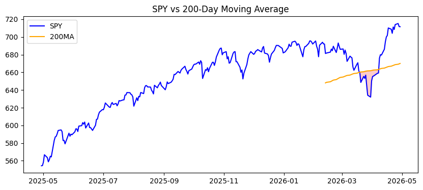
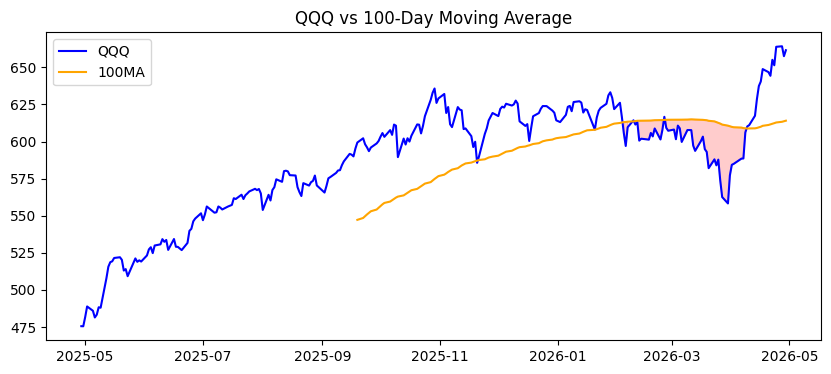
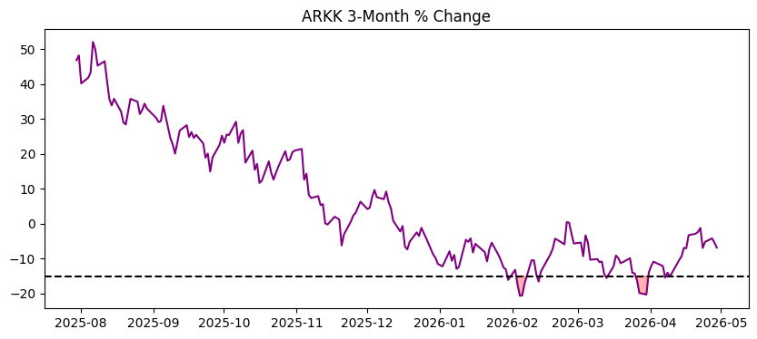
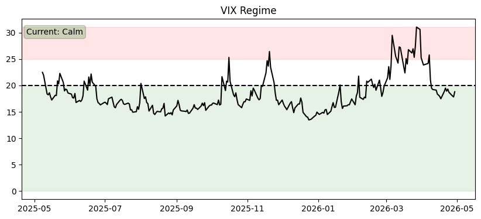
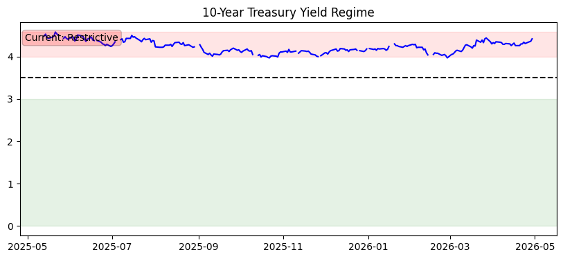
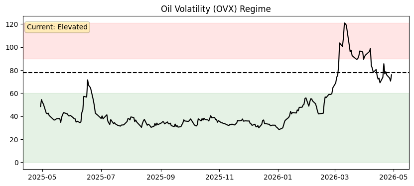
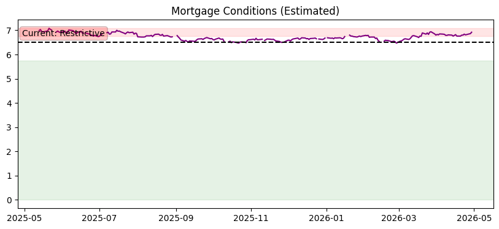

# Market Risk Monitor

**🟢 Recovery**  
**Score:** Downturn 0/3 | Recovery 3/3  
**Last Updated:** 2026-04-30

---

⚠️ **Disclaimer**

This is an automated market signal summary for informational purposes only. It is not financial advice.

---

## AI Risk Commentary

Risk commentary:
Recovery persists but is uneven — equities are above key moving averages supporting risk-on positioning, yet elevated commodity and oil volatility plus a still-high mortgage rate keep pockets of sensitivity. Monitor volatility and rates for signs of regime shift; raw data is available in /data.

Market summary:
- SPY: 711.58, trading above its 200-day MA (669.98) — broad uptrend intact and stable
- QQQ: 661.57, above its 100-day MA (614.06) — tech participation in recovery
- ARKK: -5.29% over three months — active growth/innovation exposure lags
- VIX: 18.81 — moderate volatility, stable around current level
- TNX (10yr yield): 4.42% — yields elevated vs recent lows, providing rate-sensitive headwinds
- OVX: 75.96 (regime: mid) — oil volatility elevated, potential risk for cyclicals and inflation expectations
- Mortgage rate: 6.3% (condition: Neutral) — remains high relative to pandemic lows; condition assessed as Neutral
- Overall: Recovery regime (🟢) with equities trending higher, but watch VIX, OVX and yields for potential tightening of financial conditions.

---

## Charts

### SPY Trend

### QQQ Trend

### ARKK Drawdown

### VIX

### 10Y Yield

### Oil Volatility

### Mortgage Conditions

---

## Market Snapshot

- SPY: 711.58 (200MA: 669.98)
- QQQ: 661.57 (100MA: 614.06)
- ARKK 3M Change: -5.29%

- VIX: 18.81
- TNX (10Y Yield): 4.42%
- OVX (Oil Volatility): 75.96

- Mortgage Rate: 6.3%
- Mortgage Condition: Neutral

[View raw data](data/market_snapshot.json)

---

## Latest Audio Update

[Listen to today's update](https://raw.githubusercontent.com/kam-reef/market-summary/main/audio/latest.mp3)

---

## RSS Feed

https://kam-reef.github.io/market-summary/feed.xml
