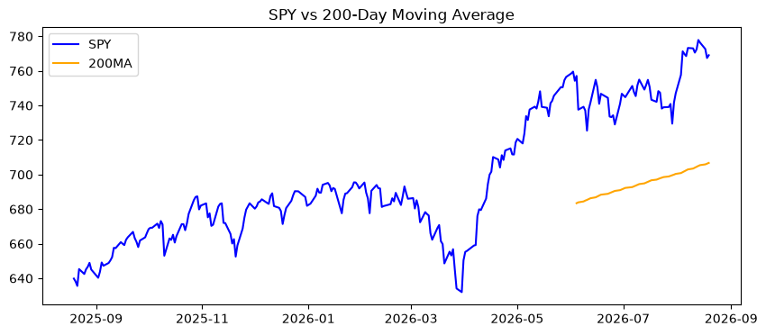
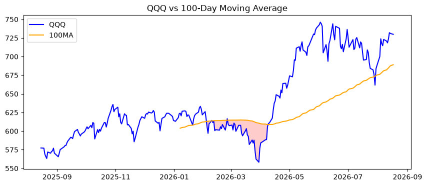
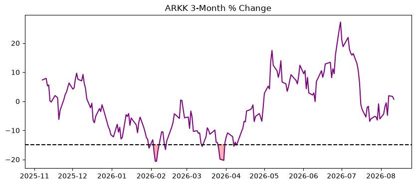
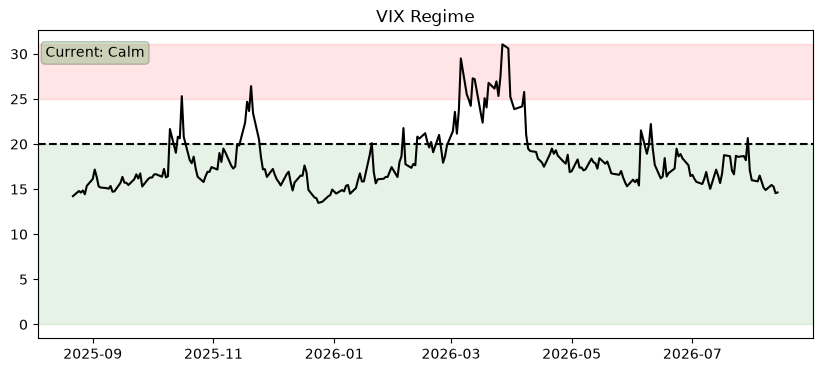
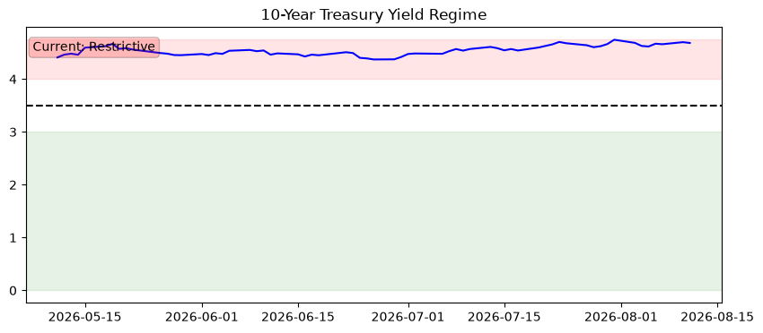
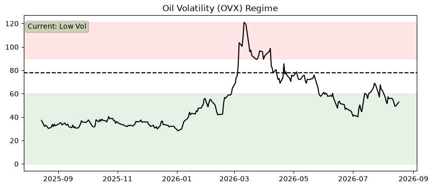
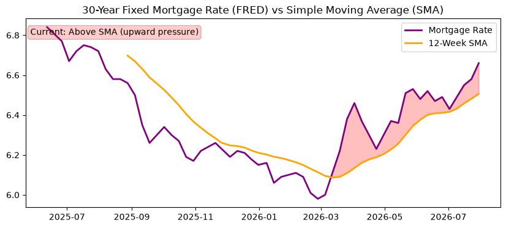
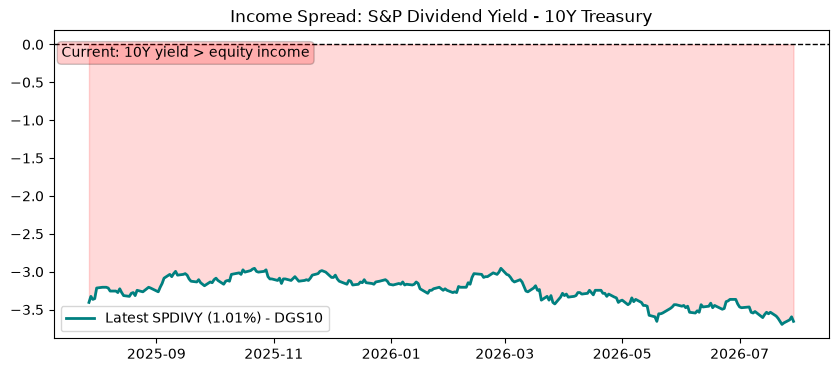

# Market Risk Monitor

**🟢 Recovery**  
**Score:** Downturn 0/3 | Recovery 3/3  
**Last Updated:** 2026-07-31

---

⚠️ **Disclaimer**

This is an automated market signal summary for informational purposes only.
It is not financial advice.

A note from the author:
There are hundreds of resources on the Internet in addition to learning resources available through your investment platform.
For example, [this one by Ramit Sethi](https://youtu.be/FF5-FbhaAyc?si=52cXbGUBFqxifu7Q), or [this one by Jaspreet Singh](https://youtu.be/qdqLIjszqy4?si=-R0Sa7C_Q0bCHY08), or [this one by Erin Moriarity](https://youtu.be/FYMfX3Aljow?si=MPQ7nICG0nA1U6vh), or articles like [this one by Fidelity](https://www.fidelity.com/learning-center/smart-money/roth-ira-taxes).
Seek out the information you need for your future self!

---

## AI Risk Commentary

**Risk Commentary**
The market remains in a recovery regime, characterized by bullish momentum in major indices as SPY and QQQ trade significantly above their key moving averages. However, elevated volatility (VIX at 17.09) and high realized volatility (OVX at 63.04) suggest underlying turbulence. While equity trends are positive, the tightening/negative income spread indicates that fixed income currently offers a superior relative yield advantage compared to equities, requiring caution for yield-sensitive strategies.

**Market Summary**
* **Equity Trend:** SPY and QQQ maintain bullish momentum, trading well above their 200-day and 100-day moving averages, respectively.
* **Volatility:** The VIX is at 17.09, while the OVX remains in a "mid" regime at 63.04.
* **Income Spread:** The SP dividend yield (1.01%) vs. the 10Y yield (4.68%) results in a spread of -3.67; this regime **favors bonds**.
* **Yield Context:** The TNX (4.74) and 10Y yield (4.68) remain elevated.
* **Mortgage Market:** Rates are at 6.66 with a "Neutral" condition.

*Raw data is available in /data*

---

## Charts

### SPY Trend

### QQQ Trend

### ARKK Drawdown

### VIX

### 10Y Yield

### Oil Volatility

### Mortgage Conditions

### SPY Trailing Dividend Yield (proxy)

---

[View raw data](data/market_snapshot.json)

---

## RSS Feed

https://kam-reef.github.io/market-summary/feed.xml

---

## Data

- Signals: [data/signals.json](data/signals.json)  
- History: [data/history.json](data/history.json)
